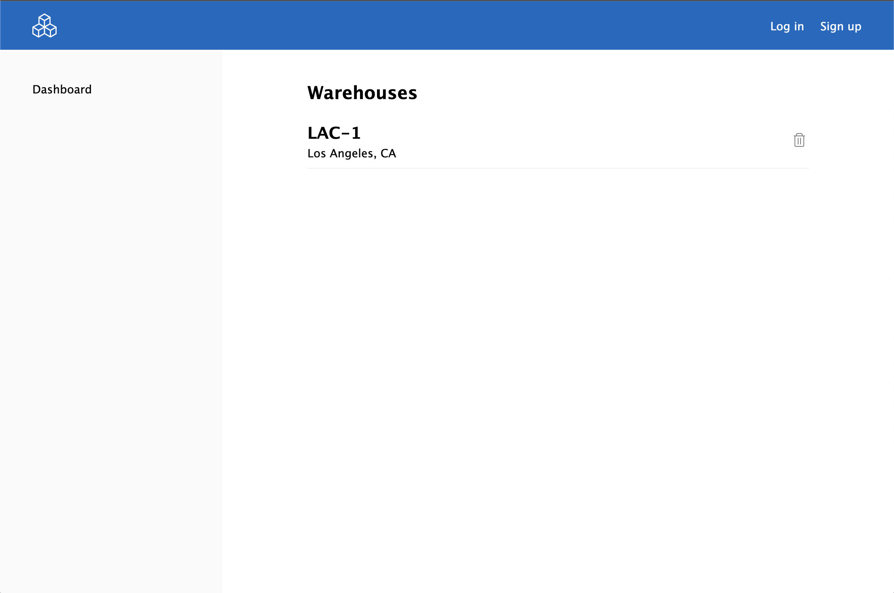

## Project
This is the first design and implementation of my warehouse tool. This was built following the MVC pattern.

Technologies and services: 
1. Node.js
2. HTML/CSS
4. Javascript
5. Passport JS
6. MongoDB and mongoose

### 1. Login/Register


### 2. Dashboard



### 2. Warehouse


### 3. Logged In Users Can Create New Posts

<div style="display: flex">
  
  
</div>

### 4. Responsive


## Setup
```
npm start
```
